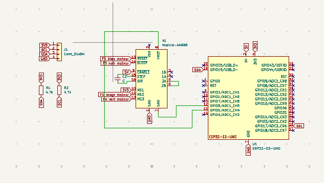

# Conception de la carte PCB

Dans la continuité du projet **DrawBot A4**, nous avons réalisé la conception d'une **carte électronique (PCB)** afin de regrouper les différents composants nécessaires au fonctionnement de la machine.

L'objectif de cette carte est de remplacer les montages réalisés lors du prototypage par une solution plus **compacte, fiable et propre**.

---

## Objectif du PCB

La carte PCB permet de centraliser les différents éléments électroniques nécessaires au fonctionnement du DrawBot.

Elle permet notamment de :

- contrôler les **moteurs pas-à-pas**
- connecter les **capteurs de fin de course**
- gérer l'interface utilisateur
- simplifier le câblage de la machine

Cette carte permet donc d'améliorer la fiabilité et l'intégration du système.

---

## Composants principaux

La carte intègre plusieurs composants essentiels :

- **ESP32** : microcontrôleur principal de la machine  
- **Drivers A4988** : pilotage des moteurs pas-à-pas  
- **Écran OLED** : affichage des informations  
- **Lecteur de carte SD** : stockage des fichiers  
- **Connecteurs moteurs et capteurs**

Ces composants permettent de contrôler l'ensemble de la machine.

---

## Schéma électronique

Le schéma électronique de la carte a été réalisé avec le logiciel **KiCad**.

Il permet de représenter l'ensemble des connexions entre les différents composants électroniques.

---

## Conception du PCB

Après la réalisation du schéma, la carte est routée afin de créer les pistes électriques reliant les composants.

Lors de cette étape, plusieurs contraintes sont respectées :

- largeur des pistes pour l'alimentation
- plan de masse pour la stabilité électrique
- placement logique des composants

Ces bonnes pratiques permettent d'obtenir une carte électronique fiable.

---

## Fichiers du projet

Le projet KiCad complet de la carte PCB est disponible ci-dessous.

[📦 Télécharger le projet PCB](pcb_drawbot.zip){: .btn .btn-primary }

---

## Résultat

La conception de cette carte PCB permet de regrouper tous les éléments électroniques nécessaires au fonctionnement du **DrawBot A4** sur un seul circuit.

Cela rend la machine plus **compacte, plus propre et plus facile à maintenir**.
