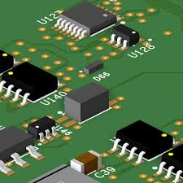

# Projet PCB – Routage de carte électronique

En parallèle du projet DrawBot A4, nous réalisons également un projet de conception et de routage d’une carte **PCB (Printed Circuit Board)**.

## Objectif

L’objectif de ce projet est de concevoir une carte électronique permettant de connecter et contrôler différents composants électroniques.

## Étapes du projet

- Schéma électronique
- Placement des composants
- Routage des pistes
- Vérification des connexions
- Fabrication du PCB

## Exemple du PCB

## Outils utilisés

- logiciel de conception PCB
- routage des pistes
- vérification électrique
